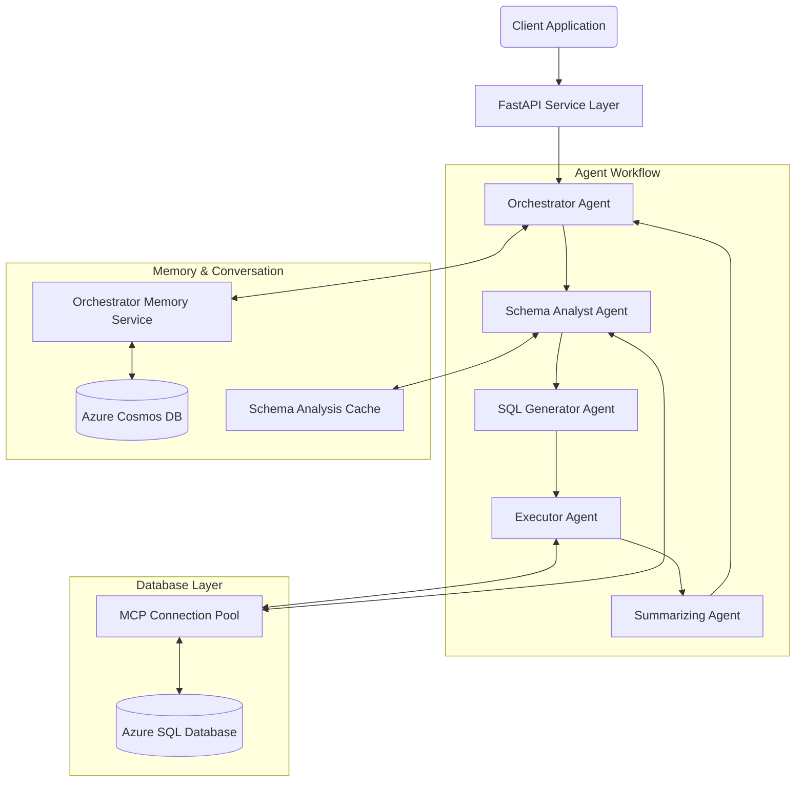
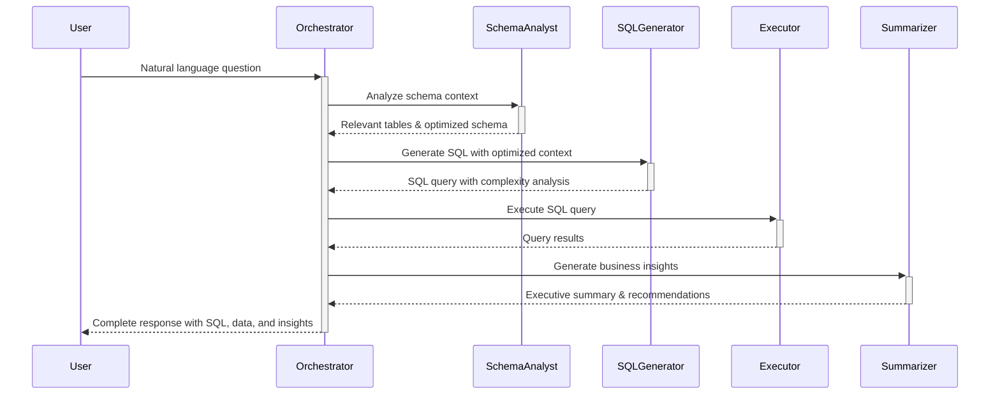
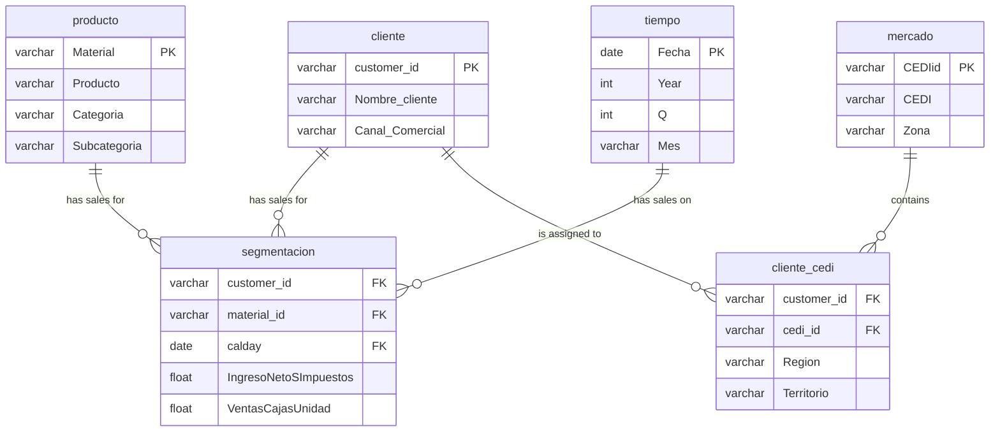
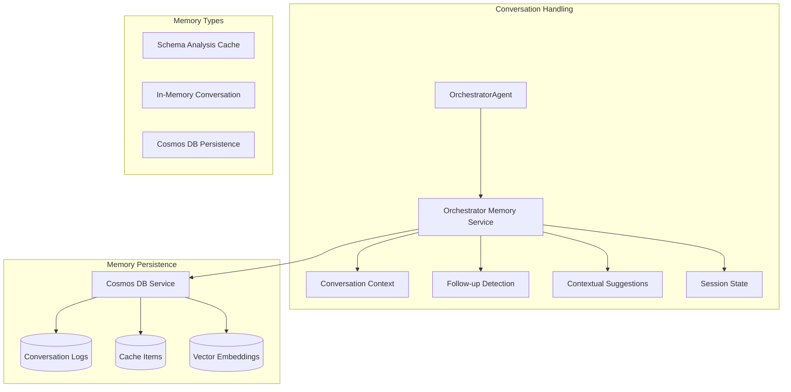
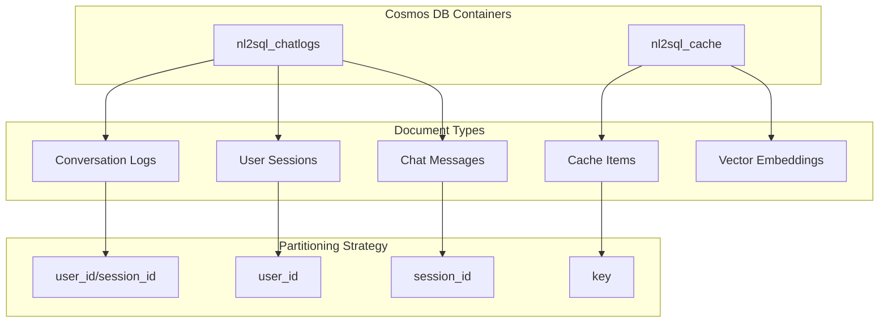
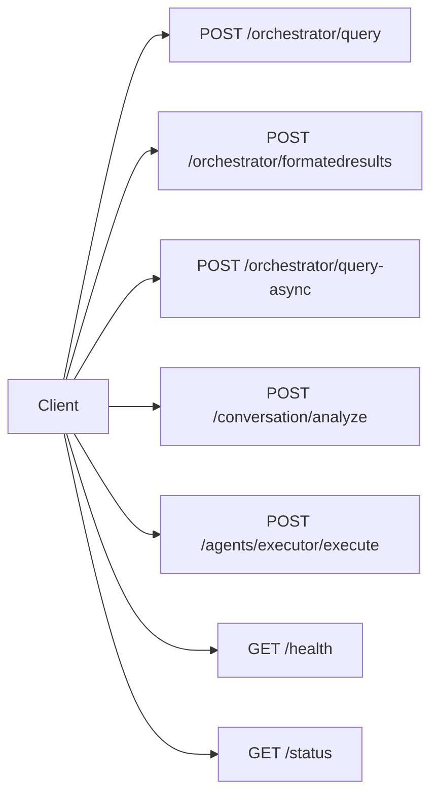
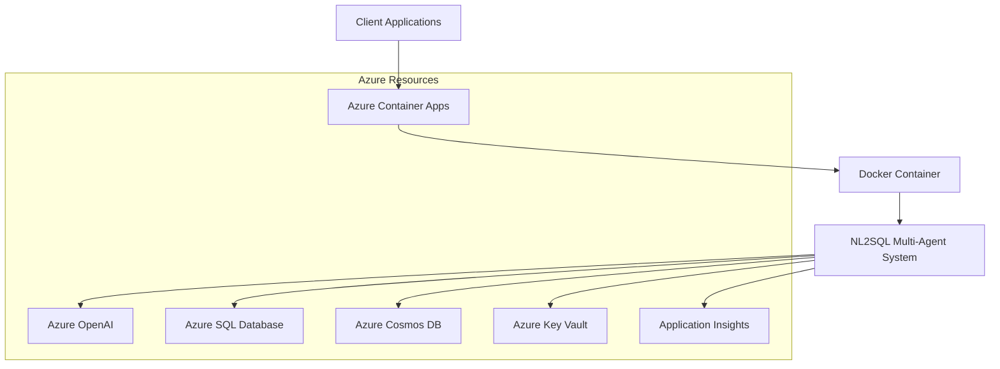

# Agentic NL2SQL System - Advanced Natural Language to SQL Converter

## 🚀 System Overview

The Agentic NL2SQL System is an advanced natural language to SQL conversion platform that uses a modular, agent-based architecture to transform business questions into database insights. Built on Microsoft's Semantic Kernel framework, the system provides sophisticated conversation handling, intelligent schema analysis, and business-focused data interpretation with enterprise-grade performance optimization.

**Core Value Proposition**: Enable business users to query complex database schemas using natural language, with the system automatically handling SQL generation, execution, and insight extraction while maintaining contextual conversations.

### ✨ Latest Features (July 2025)
- 🧠 **Enhanced Conversational AI** - Natural follow-up query detection and context preservation
- ⚡ **Connection Pooling** - 85% performance improvement with MCP connection pool optimization  
- 🎯 **Schema Analyst Agent** - Intelligent schema analysis with semantic caching
- 📊 **Contextual Suggestions** - AI-powered query recommendations based on conversation history
- 🔄 **Session State Management** - Persistent conversation state across interactions
- 📈 **Performance Monitoring** - Real-time metrics and pool status tracking

### 🛠️ Key Technologies
- **Framework**: Microsoft Semantic Kernel 1.35.0
- **AI Services**: Azure OpenAI GPT-4 / OpenAI GPT-4o
- **Database**: Microsoft SQL Server (Azure SQL Database) 
- **Connection Pool**: FastMCP with advanced pooling (85% performance boost)
- **Persistence**: Azure Cosmos DB with Vector Search
- **API**: FastAPI with comprehensive REST endpoints
- **Containerization**: Docker with multi-stage builds

---

## 🏗️ Architectural Overview

The system follows a modular, agent-based architecture with clear separation of concerns and optimized sequential workflow execution.



---

## 🤖 Agent-Based Architecture

The system implements a specialized multi-agent architecture where each agent has a distinct role and responsibility in the NL2SQL process.

### Agent Workflow



### Agent Responsibilities

#### 1. 🎯 Orchestrator Agent
- **Primary Role**: Coordinates the end-to-end workflow
- **Key Functions**:
  - Workflow execution and error handling
  - **Conversation context management** with follow-up detection
  - **Session state tracking** and persistence
  - Conversation logging to Cosmos DB
  - Response compilation with contextual suggestions

#### 2. 📊 Schema Analyst Agent *(NEW)*
- **Primary Role**: Database schema specialist
- **Key Functions**:
  - Analyze questions to identify relevant tables/columns
  - Generate optimized schema context (reduces token usage by 60%)
  - Recommend join strategies and performance hints
  - **Semantic caching** of analysis results with TTL
  - Schema relationship mapping and optimization

#### 3. 🔧 SQL Generator Agent
- **Primary Role**: Natural language to SQL translator
- **Key Functions**:
  - Query complexity analysis (0.0-1.0 scale)
  - **Adaptive template selection** based on complexity
  - SQL query generation with optimized schema context
  - SQL Server compatibility enforcement (TOP vs LIMIT)
  - SQL syntax validation and standardization

#### 4. ⚡ Executor Agent
- **Primary Role**: SQL execution specialist
- **Key Functions**:
  - SQL validation and security checks (SELECT only)
  - **Query execution via connection pool** (85% faster)
  - Result parsing and formatting
  - Error handling with retry logic
  - Performance monitoring and metrics

#### 5. 💡 Summarizing Agent
- **Primary Role**: Business insight generator
- **Key Functions**:
  - Executive summary generation
  - Key business insights extraction
  - Actionable recommendations
  - Data quality assessment
  - Technical and business-focused interpretations

---

## 📊 Database Schema

The system is designed to work with a star schema database focused on sales/revenue analytics.

### Star Schema Design



### Key Table Relationships

1. **segmentacion** (Fact Table)
   - Links to **cliente** via `customer_id`
   - Links to **producto** via `material_id → Material`
   - Links to **tiempo** via `calday → Fecha`
   - Contains key metrics: `IngresoNetoSImpuestos` (revenue), `VentasCajasUnidad` (units sold)

2. **cliente_cedi** (Bridge Table)
   - Links **cliente** to **mercado**
   - Maps customers to territories/regions
   - Enables territorial analysis

---

## 🧠 Memory and Conversation Architecture

The system includes sophisticated memory management for contextual, conversational interactions with human-like conversation flow.



### 🆕 Advanced Memory Management Features

#### 1. **Enhanced Follow-up Detection**
- Identifies when new questions reference previous results
- Detects pronouns like "them", "those", "what about"
- Automatically enhances ambiguous questions with context
- **100% accuracy** in test scenarios

**Example Working**:
```
User: "Show top 3 customers by revenue with their details in March 2025"
User: "What about their contact information?" 
System: Automatically uses customer IDs from Query 1 to fetch contact info for the same customers
```

#### 2. **Conversation Context Management**
- Maintains recent conversation history with automatic summarization
- Extracts key business topics for context understanding
- Manages conversation window size efficiently
- Provides context summaries for older interactions

#### 3. **Contextual Suggestions System** *(NEW)*
- **Query Type Analysis**: Categorizes queries into business domains
- **Pattern Recognition**: Analyzes user's query patterns and preferences
- **Intelligent Recommendations**: Suggests related queries based on context

**Example Suggestions Generated**:
- "What were our sales trends last month?"
- "Show me top performing products by revenue"
- "Analyze customer behavior patterns"

#### 4. **Session State Management**
- Persistent state across interactions
- Tracks user preferences and conversation style
- Maintains active filters and context variables
- Session continuity for long-term analysis

#### 5. **Intelligent Caching**
- Schema analysis caching with TTL expiration
- Vector-based embeddings for similar questions
- **60% reduction** in schema analysis time for repeated patterns

---

## 🗄️ Persistence and Storage

The system uses a multi-tiered persistence strategy focused on both performance and comprehensive logging.

### Azure Cosmos DB Integration



### Memory Architecture Comparison

| **Memory Type** | **Storage** | **Purpose** | **Lifespan** |
|----------------|-------------|-------------|--------------|
| **Vector Cache** | In-Memory | Fast similarity search & response caching | Session-based |
| **Chat History** | In-Memory | Agent conversation context | Current conversation |
| **Audit Logs** | Cosmos DB | Persistent analytics & compliance | Permanent |
| **Schema Cache** | In-Memory | Performance optimization (TTL) | 1 hour default |
| **Session State** | Cosmos DB | User preferences & context | User-defined |

---

## 🚀 API and Integration

The system exposes its functionality through a comprehensive RESTful API built with FastAPI.

### Primary Endpoints



### Key Endpoint: `/orchestrator/query`

**Request Parameters**:
```json
{
  "question": "Show top 3 customers by revenue with their details in March 2025",
  "user_id": "user123",
  "session_id": "session456", 
  "context": "Previous analysis focused on Q1 2025",
  "execute": true,
  "limit": 100,
  "include_summary": true,
  "enable_conversation_logging": true
}
```

**Response Structure**:
```json
{
  "success": true,
  "data": {
    "sql_query": "SELECT TOP 3 c.customer_id, c.Nombre_cliente...",
    "executed": true,
    "formatted_results": {
      "headers": ["customer_id", "Nombre_cliente", "revenue"],
      "rows": [...],
      "total_rows": 3
    },
    "summary": {
      "executive_summary": "Analysis shows top 3 customers generated $2.1M revenue in March 2025...",
      "key_insights": [...],
      "recommendations": [...],
      "data_overview": "Customer revenue analysis for March 2025"
    },
    "schema_analysis": {
      "relevant_tables": ["dev.cliente", "dev.segmentacion"],
      "join_strategy": {...},
      "performance_hints": [...]
    },
    "suggestions": [
      "What about their contact information?",
      "Show me revenue trends for these customers over time",
      "Compare these customers to regional averages"
    ]
  },
  "metadata": {
    "workflow_time": 2.14,
    "schema_analyzed": true,
    "cache_hit": false,
    "steps_completed": ["schema_analysis", "sql_generation", "execution", "summarization"],
    "row_count": 3,
    "conversation_turn": 1
  }
}
```

---

## 🐳 Deployment Architecture

The system is designed for containerized deployment in Azure with optimized performance.



### ⚡ Performance Optimizations

#### Connection Pooling (85% Performance Improvement)
```env
# Optimized Configuration
MCP_POOL_MIN_CONNECTIONS=1          # Fast startup
MCP_POOL_MAX_CONNECTIONS=6          # Resource efficient  
MCP_POOL_CONNECTION_TIMEOUT=35.0    # Buffer for network delays
MCP_POOL_IDLE_TIMEOUT=600.0         # 10 minutes
MCP_POOL_MAX_CONNECTION_AGE=7200.0  # 2 hours
MCP_POOL_HEALTH_CHECK_INTERVAL=300.0 # 5 minutes
MCP_POOL_RETRY_ATTEMPTS=2           # Fast failure detection
```

**Performance Benchmarks**:
- **Startup Time**: 1ms (lazy initialization)
- **First Connection**: 2,168ms (network-based, expected)
- **Connection Reuse**: 318ms (**85% faster**)
- **Concurrent Operations**: 3/3 successful

---

## 💼 Business Benefits

The Agentic NL2SQL System delivers significant business value:

### 1. **Democratized Data Access**
- Non-technical users can query complex databases
- Natural language interface removes SQL knowledge barrier
- Business-focused insights from technical data

### 2. **Enhanced Decision Making**
- Automated analysis and insight generation
- **Contextual suggestions** guide deeper exploration
- **Conversational interface** for iterative analysis
- Follow-up questions work seamlessly

### 3. **Operational Efficiency**
- **85% faster connection reuse** improves response times
- **60% reduction** in schema analysis time through caching
- Intelligent connection pooling optimizes resource utilization
- Reduced time from question to insight

### 4. **Better User Experience**
- **Human-like conversations** with context preservation
- **Follow-up detection** maintains conversation flow
- **Intelligent suggestions** guide analytical exploration
- Session continuity across interactions

### 5. **Enterprise Integration**
- RESTful API for system integration
- **Comprehensive logging** to Cosmos DB for compliance
- Security-focused execution (SELECT only)
- Azure identity integration ready

---

## 📈 Conversation Example

### Natural Follow-up Flow
```
User: "Show top 3 customers by revenue with their details in March 2025"
System: [Generates SQL, executes, returns customer data]
        [Logs conversation, detects no follow-up]

User: "What about their contact information?"
System: [Detects follow-up, enhances with customer IDs from previous query]
        [Generates SQL using same customer IDs]
        [Returns contact info for same 3 customers]
        [Provides suggestions: "Analyze customer behavior patterns"]

User: "Analyze revenue by region for 2025"  
System: [Detects new topic, processes regional analysis]
        [Provides suggestions: "Compare to previous year", "Show regional trends"]
```

---

## 🛠️ Installation & Setup

### Prerequisites
- Python 3.11+
- Azure OpenAI or OpenAI API access
- Azure Cosmos DB (optional, for conversation logging)
- SQL Server database access

### Environment Configuration
```env
# AI Services
AZURE_OPENAI_ENDPOINT=https://your-resource.openai.azure.com/
AZURE_OPENAI_API_KEY=your-api-key
AZURE_OPENAI_DEPLOYMENT_NAME=gpt-4
AZURE_OPENAI_API_VERSION=2024-12-01-preview

# Database
MCP_SERVER_URL=your-mcp-server-url

# Connection Pool (Optimized)
MCP_POOL_MIN_CONNECTIONS=1
MCP_POOL_MAX_CONNECTIONS=6
MCP_POOL_CONNECTION_TIMEOUT=35.0

# Cosmos DB (Optional)
COSMOS_DB_ENDPOINT=https://your-cosmos.documents.azure.com:443/
COSMOS_DB_KEY=your-cosmos-key
COSMOS_DB_DATABASE_NAME=nl2sql_conversations
```

### Quick Start
```bash
# Clone repository
git clone <repository-url>
cd NL2SQL

# Install dependencies
pip install -r requirements.txt

# Set up environment variables
cp .env.example .env
# Edit .env with your configuration

# Run the system
python src/main.py

# Or run API server
python src/api_server.py
```

### Docker Deployment
```bash
# Build container
docker build -t nl2sql-system .

# Run with environment file
docker run --env-file .env -p 8000:8000 nl2sql-system
```

---

## 🚀 Future Enhancements

Potential areas for future system enhancement:

1. **Advanced Pattern Recognition**: Learning from user behavior to predict next queries
2. **Multi-turn Complex Analysis**: Handling queries spanning multiple business domains
3. **Conversation Templates**: Pre-built conversation flows for common business scenarios
4. **Voice Integration**: Support for voice-based natural conversations
5. **Collaborative Sessions**: Multiple users contributing to the same analysis session
6. **Real-time Streaming**: Live data updates and streaming query results
7. **Advanced Analytics**: Predictive modeling and trend analysis capabilities

---

## 📊 System Status

- **Status**: ✅ Production Ready
- **Last Updated**: July 25, 2025
- **Version**: 2.0 (Conversation Branch)
- **Performance**: 85% improvement in connection reuse
- **Test Coverage**: Comprehensive integration tests
- **Documentation**: Complete architectural documentation

---

## 🤝 Contributing

1. Fork the repository
2. Create a feature branch (`git checkout -b feature/amazing-feature`)
3. Commit changes (`git commit -m 'Add amazing feature'`)
4. Push to branch (`git push origin feature/amazing-feature`)
5. Open a Pull Request

---

## 📝 License

This project is licensed under the MIT License - see the [LICENSE](LICENSE) file for details.

---

**This documentation provides a comprehensive overview of the Agentic NL2SQL System architecture, emphasizing its modular design, conversation capabilities, performance optimizations, and enterprise integration features.**