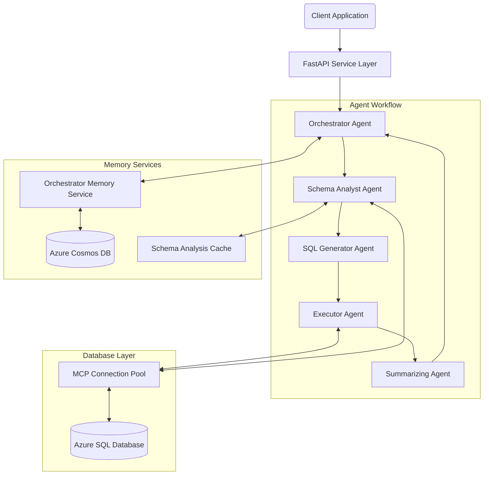
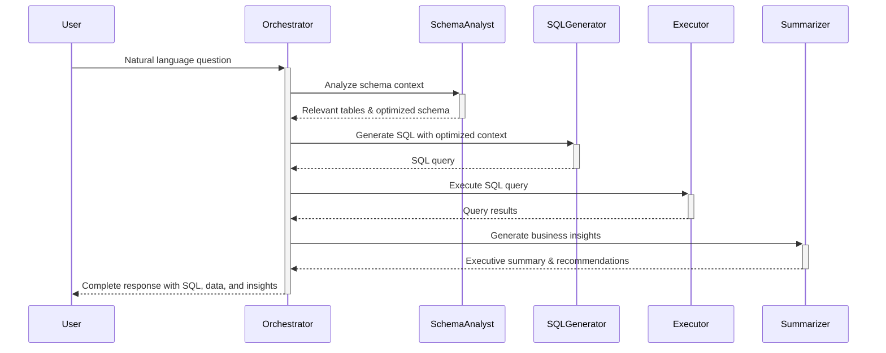
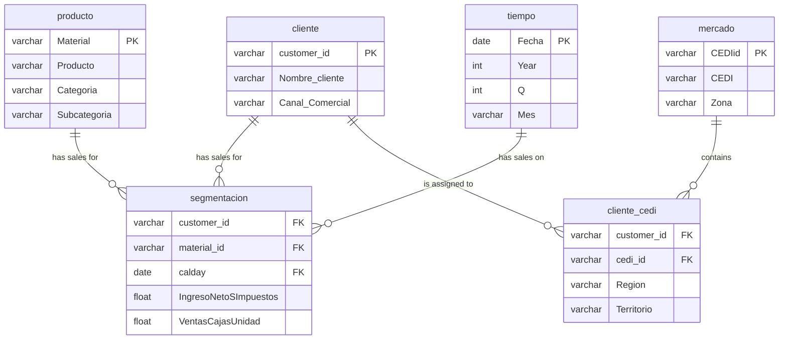
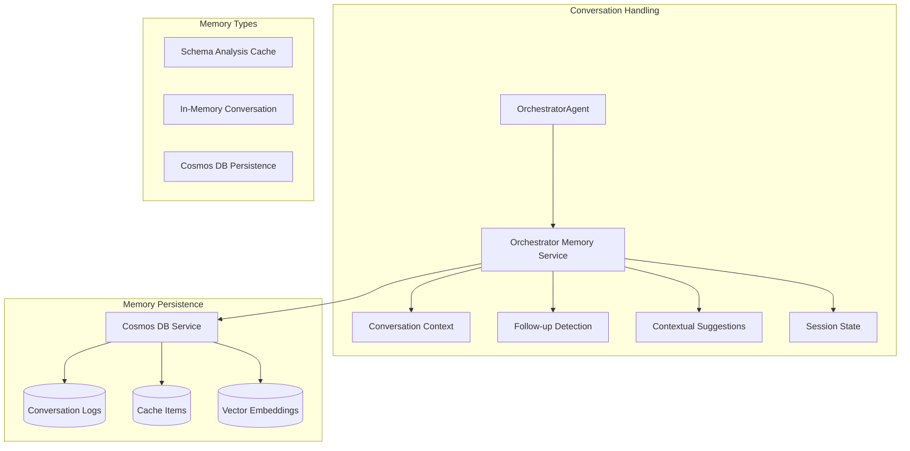
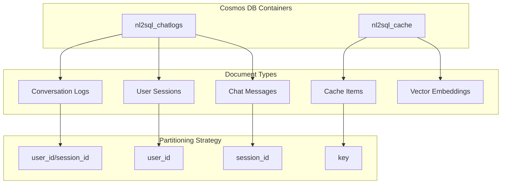
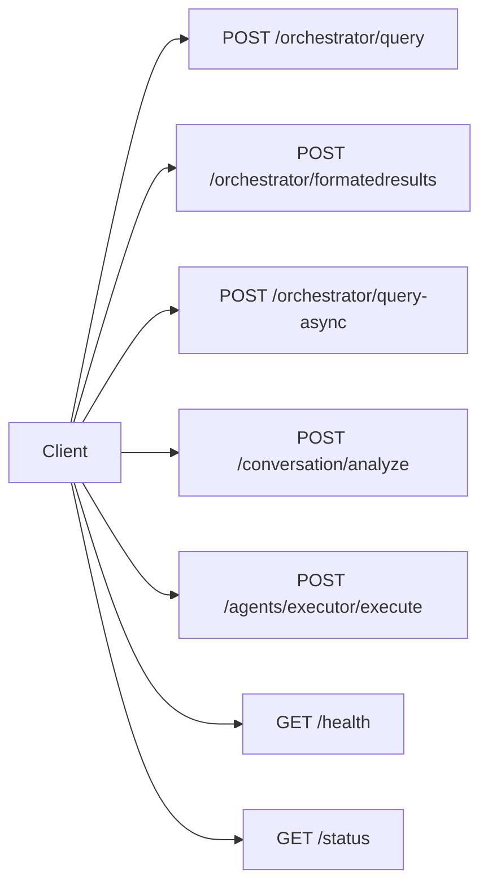
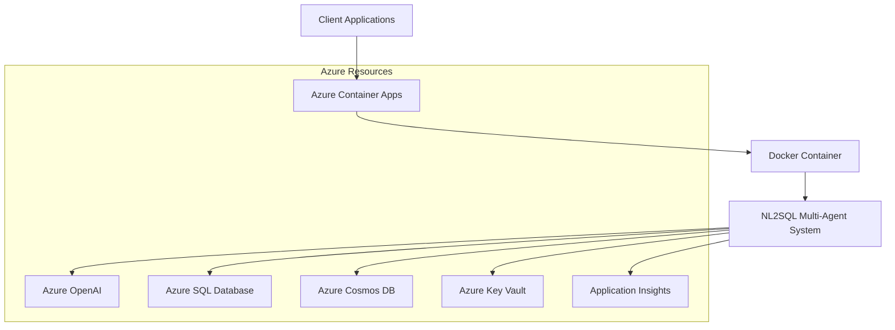

Collecting workspace information# Architecture Documentation: Agentic NL2SQL System

## 1. System Overview

The Agentic NL2SQL System is an advanced natural language to SQL conversion platform that uses a modular, agent-based architecture to transform business questions into database insights. Built on Microsoft's Semantic Kernel framework, the system provides sophisticated conversation handling, intelligent schema analysis, and business-focused data interpretation.

**Core Value Proposition**: Enable business users to query complex database schemas using natural language, with the system automatically handling SQL generation, execution, and insight extraction.

**Key Technologies**:
- **Framework**: Microsoft Semantic Kernel 1.35.0
- **AI Services**: Azure OpenAI / OpenAI GPT-4
- **Database Connectivity**: SQL Server via MCP Connection Pool
- **Persistence**: Azure Cosmos DB with Vector Search
- **API**: FastAPI with REST endpoints

## 2. Architectural Overview

The system follows a modular, agent-based architecture with clear separation of concerns and sequential workflow execution.



## 3. Agent-Based Architecture

The system implements a specialized multi-agent architecture where each agent has a distinct role and responsibility in the NL2SQL process.

### Agent Workflow



### Agent Responsibilities

#### 1. Orchestrator Agent
- **Primary Role**: Coordinates the end-to-end workflow
- **Key Functions**:
  - Workflow execution and error handling
  - Conversation context management
  - Follow-up query detection
  - Conversation logging to Cosmos DB
  - Response compilation and formatting

#### 2. Schema Analyst Agent
- **Primary Role**: Database schema specialist
- **Key Functions**:
  - Analyze questions to identify relevant tables/columns
  - Generate optimized schema context
  - Recommend join strategies
  - Semantic caching of analysis results
  - Performance optimization hints

#### 3. SQL Generator Agent
- **Primary Role**: Natural language to SQL translator
- **Key Functions**:
  - Query complexity analysis (0.0-1.0 scale)
  - Adaptive template selection based on complexity
  - SQL query generation with optimized context
  - SQL syntax validation and standardization
  - SQL Server compatibility enforcement

#### 4. Executor Agent
- **Primary Role**: SQL execution specialist
- **Key Functions**:
  - SQL validation and security checks
  - Query execution via connection pool
  - Result parsing and formatting
  - Error handling and optimization
  - Cost-optimized execution using smaller models

#### 5. Summarizing Agent
- **Primary Role**: Business insight generator
- **Key Functions**:
  - Executive summary generation
  - Key business insights extraction
  - Actionable recommendations
  - Data quality assessment
  - Technical and business-focused interpretations

## 4. Database Schema

The system is designed to work with a star schema database focused on sales/revenue analytics.

### Star Schema Design



### Key Table Relationships

1. **segmentacion** (Fact Table)
   - Links to **cliente** via `customer_id`
   - Links to **producto** via `material_id → Material`
   - Links to **tiempo** via `calday → Fecha`
   - Contains key metrics: `IngresoNetoSImpuestos` (revenue), `VentasCajasUnidad` (units sold)

2. **cliente_cedi** (Bridge Table)
   - Links **cliente** to **mercado**
   - Maps customers to territories/regions
   - Enables territorial analysis

## 5. Memory and Conversation Architecture

The system includes sophisticated memory management for contextual, conversational interactions.



### Memory Management Features

1. **Follow-up Detection**
   - Identifies when new questions reference previous results
   - Detects pronouns like "them", "those", "that" 
   - Automatically enhances ambiguous questions with context
   - Preserves conversation flow across multiple turns

2. **Conversation Context Management**
   - Maintains recent conversation history
   - Automatically summarizes older interactions
   - Extracts key topics for context understanding
   - Manages conversation window size efficiently

3. **Contextual Suggestions**
   - Generates relevant follow-up questions
   - Based on query patterns and business domains
   - Suggests unexplored analytical directions
   - Improves user experience with guided analysis

4. **Session State**
   - Tracks user preferences and active filters
   - Maintains conversation topics and styles
   - Stores frequently referenced data for quick access
   - Enables persistence across user sessions

5. **Intelligent Caching**
   - Schema analysis caching for performance
   - Both exact and semantic similarity matching
   - Vector-based embeddings for similar questions
   - TTL-based expiration for cache freshness

## 6. Persistence and Storage

The system uses a multi-tiered persistence strategy focused on both performance and comprehensive logging.

### Azure Cosmos DB Integration



### Memory Architecture Comparison

| **Memory Type** | **Storage** | **Purpose** | **Lifespan** |
|----------------|-------------|-------------|--------------|
| **Vector Cache** | In-Memory | Fast similarity search & response caching | Session-based |
| **Chat History** | In-Memory | Agent conversation context | Current conversation |
| **Audit Logs** | Cosmos DB | Persistent analytics & compliance | Permanent |
| **Schema Cache** | In-Memory | Performance optimization | TTL-based |

## 7. API and Integration

The system exposes its functionality through a RESTful API built with FastAPI.

### Primary Endpoints



### Key Endpoint: `/orchestrator/query`

**Request Parameters**:
- `question`: Natural language question
- `user_id`: User identifier (for conversation logging)
- `session_id`: Session identifier (for conversation tracking)
- `context`: Optional additional context
- `execute`: Whether to execute generated SQL (default: true)
- `limit`: Row limit for results (default: 100)
- `include_summary`: Whether to generate summary (default: true)
- `enable_conversation_logging`: Whether to log conversations (default: true)

**Response Structure**:
```
{
  "success": boolean,
  "data": {
    "sql_query": string,
    "executed": boolean,
    "formatted_results": {
      "headers": string[],
      "rows": object[],
      "total_rows": number
    },
    "summary": {
      "executive_summary": string,
      "key_insights": object[],
      "recommendations": object[],
      "data_overview": string
    },
    "schema_analysis": {
      "relevant_tables": string[],
      "join_strategy": object,
      "performance_hints": string[]
    },
    "suggestions": string[]
  },
  "metadata": {
    "workflow_time": number,
    "schema_analyzed": boolean,
    "cache_hit": boolean,
    "steps_completed": string[],
    "row_count": number
  }
}
```

## 8. Deployment Architecture

The system is designed for containerized deployment in Azure.



### Containerization

The system is containerized using Docker for simplified deployment and scaling:
- Dockerfile with multi-stage build
- Environment variable configuration
- Health check endpoints
- Connection pooling for efficiency

## 9. Business Benefits

The Agentic NL2SQL System delivers significant business value:

1. **Democratized Data Access**
   - Non-technical users can query complex databases
   - Natural language interface removes SQL knowledge barrier
   - Business-focused insights from technical data

2. **Enhanced Decision Making**
   - Automated analysis and insight generation
   - Contextual suggestions guide deeper exploration
   - Conversational interface for iterative analysis

3. **Operational Efficiency**
   - Reduced time from question to insight
   - Schema optimization reduces token usage
   - Connection pooling improves resource utilization
   - Intelligent caching enhances performance

4. **Better User Experience**
   - Conversation history maintains context
   - Follow-up questions work naturally
   - Suggestions guide analytical exploration
   - Business-focused summaries highlight key insights

5. **Enterprise Integration**
   - RESTful API for system integration
   - Comprehensive logging for compliance
   - Security-focused execution (SELECT only)
   - Azure identity integration

## 10. Future Enhancements

Potential areas for future system enhancement:

1. **Advanced Pattern Recognition**: Learning from user behavior to predict next queries
2. **Multi-turn Complex Analysis**: Handling queries spanning multiple business domains
3. **Conversation Templates**: Pre-built conversation flows for common business scenarios
4. **Voice Integration**: Support for voice-based natural conversations
5. **Collaborative Sessions**: Multiple users contributing to the same analysis session

---

This documentation provides a comprehensive overview of the Agentic NL2SQL System architecture, emphasizing its modular design, conversation capabilities, and enterprise integration features.